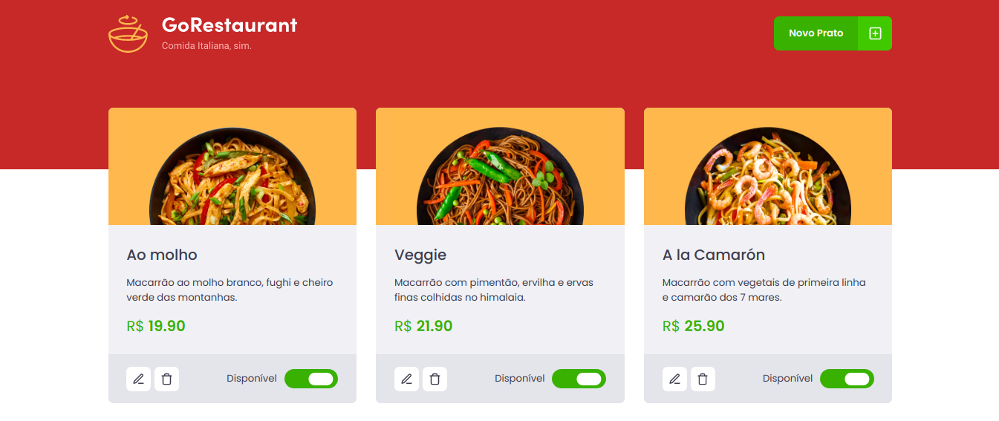

<h1>Projeto GoRestaurant</h1>
 Exemplo interface admin de restaurante.

<a href="/assets/ResultadoCascavelJulho.pdf" target="__blanc">Relatório exemplo</a>
## 🚀 Tecnologias

Esse projeto foi desenvolvido com as seguintes tecnologias:

- [React]
- [json-server]

## 💻 Projeto

  <h4>Features:</h4>
  <ul>
    <li>Dashboard com listagens dos pratos</li>
    <li>Cadastro de novos pratos</li>
    <li>Atualização de pratos (preço, descrição, nome)</li>
    <li>Exclusão de pratos do cardápio</li>
    <li>Controle de disponibilidade (Toogle)</li>
  </ul>

## 🔖 Layout

<table>
  <tr>
    <td><strong>Dashboard - Painel de listagem</strong></td>
  <tr>

   <tr>
    <td></td>
  <tr>
</table>

## Licença

Esse projeto está sob a licença MIT.

Execute yarn install ou npm install para instalação.
Executar o projeto rode yarn start ou npm start

